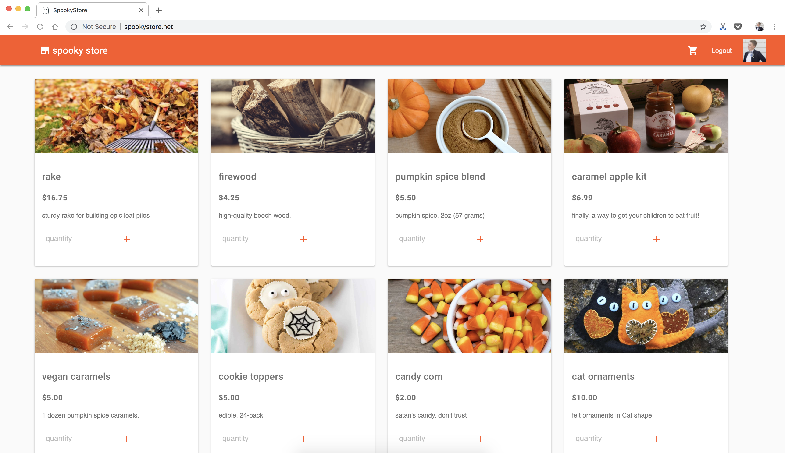
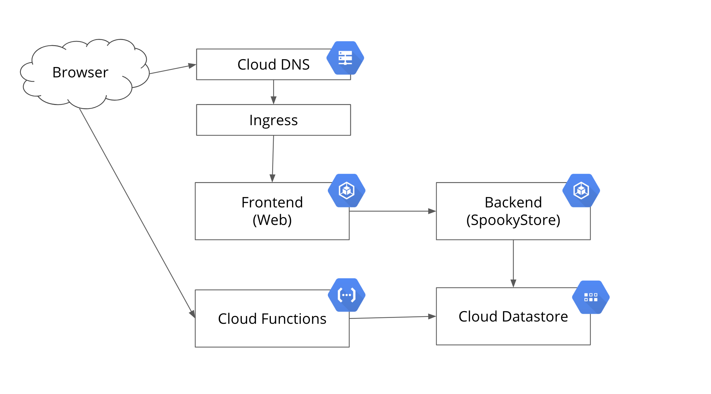

# spookystore
sample fullstack web application hosted on GKE

## What is Spookystore? 



Spookystore is a sample web store that offers a variety of Fall items. Users can log into the store with their Google account, add products to their Cart, and initiate a Checkout. Past transactions, along with a Products inventory, are stored in a database.

## How to Run 

### Minikube

1. [Install](https://kubernetes.io/docs/tasks/tools/install-minikube/) and start minikube: `minikube start`. 
2. Install [Skaffold](https://github.com/GoogleContainerTools/skaffold) 
3. `skaffold dev -f skaffold-minikube.yml`  - this will deploy Spookystore to the local minikube cluster, then watch for code changes. On change, skaffold will build a new image and patch in the changes. 


### Google Kubernetes Engine (GKE)  

1. [Create a new GCP project](https://cloud.google.com/resource-manager/docs/creating-managing-projects) 
2. [Create a new GKE cluster](https://cloud.google.com/kubernetes-engine/docs/quickstart)
3. [Set up a new Service Account](https://cloud.google.com/kubernetes-engine/docs/tutorials/authenticating-to-cloud-platform) 
4. [Enable the OAuth API](https://developers.google.com/identity/protocols/OAuth2) 
5. [Enable Cloud Datastore](https://cloud.google.com/datastore/docs/activate)
6. Add the [Transaction Counter](https://github.com/m-okeefe/spookystore/blob/master/functions/count_transaction.py) as a Cloud Function, and update the [calls in the frontend](https://github.com/m-okeefe/spookystore/blob/master/cmd/web/static/template/layout.html#L45) to reflect your new Function's trigger URL.  
7. `skaffold run -f skaffold.yml`  - this will build and deploy Spookystore to your GKE cluster, then halt.


*note* - Due to security concerns, Google's OAuth redirect will not work with a raw IP. Therefore, unless you map a domain name to the Frontend's Ingress and set up a Cloud DNS zone, you will not be able to login. 

## Architecture  

 

SpookyStore is a microservices-based, full-stack web application. Given that the project's goal is to use GCP products and explore how they work together, each component lives in GCP: 

1. **[Cloud DNS](https://cloud.google.com/dns/quickstart)**: A DNS Zone maps `spookystore.net` to a GKE [Static IP address](https://cloud.google.com/compute/docs/ip-addresses/reserve-static-external-ip-address).  
2. **Ingress**: The Static IP is assigned to the frontend web server's Ingress resource. This Ingress resource allows traffic into a Kubernetes service which fronts the frontend server container. 
3. **Frontend**: All external requests go through the Frontend web server. This server is written in Go and exposes a set of endpoints: `/home`, `/checkout`, etc. The frontend renders one dynamic HTML template per page, and has some lightweight client-side javascript to handle button clicks. The CSS is [Material Design Lite](https://getmdl.io/customize/index.html).  
4. **Backend**: The Frontend calls the Backend web server, also written in Go. This server is gRPC-based and handles calls to Cloud Datastore. 
5. **Cloud Datastore**: holds `Product`, `User`, and `TransactionCounter` entities. The [JSON Products inventory](https://github.com/m-okeefe/spookystore/blob/master/cmd/spookystore/inventory/products.json) is added to Datastore on startup. Users are added to the database when they login with their Google account. 
6. **Cloud Functions**: A small Python [function](https://github.com/m-okeefe/spookystore/blob/master/functions/count_transaction.py) increments a Total Transactions counter in Cloud Datastore. This counter keeps track of all transactions across all users. This Function is triggered in a Javascript function when any user checks out. 


## Contributing 

### Run from source 

1. Compile the backend (`spookystore`): `make`  
2. Compile the frontend (`web`) server: `make web` 
3. In a terminal tab, start the backend server: 

```
./bin/spookystore --addr=:8001 --google-project-id=spookystore-18
```

4. In another terminal tab, `cd ./cmd/web` and start the frontend server: 
```
./web -addr=:8000 --spooky-store-addr=:8001 \
    --google-oauth2-config=/Users/mokeefe/spooky-oauth.json \
    --google-project-id=spookystore-18
``` 

5. In a browser, navigate to `localhost:8000` to view the SpookyStore. 


### Codegen from `.proto` 

`protoc -I . ./spookystore.proto --go_out=plugins=grpc:.` 
